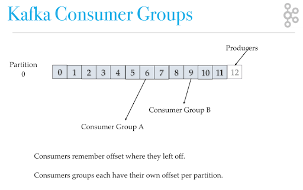

### Kafka cluster
> Kafka’s having more than one broker are called as Kafka cluster. A Kafka cluster can be expanded without downtime. These clusters are used to manage the persistence and replication of message data.

### Broker
> 1. Brokers are simple system responsible for maintaining the published data. Each broker may have zero or more partitions per topic. Assume, if there are N partitions in a topic and N number of brokers, each broker will have one partitio.
> 2. Assume if there are N partitions in a topic and more than N brokers (n + m), the first N broker will have one partition and the next M broker will not have any partition for that particular topic.
> 3. Assume if there are N partitions in a topic and less than N brokers (n-m), each broker will have one or more partition sharing among them. This scenario is not recommended due to unequal load distribution among the broker.

### Publisher 
> Kafka producers send records to topics. The records are sometimes referred to as messages. The producer picks which partition to send a record to per topic. The producer can send records round-robin. The producer could implement priority systems based on sending records to certain partitions based on the priority of the record

### Consumer 
> Consumer is a single entity which reads messages from the  topic on which the publisher has sent the message.

### Consumer Group

> A collection of Consumer is called as consumer group, whereas each consumer reads messages from different partitions A consumer group has a unique id. Each consumer group is a subscriber to one or more Kafka topics. Each consumer group maintains its offset per topic partition. If you need multiple subscribers, then you have multiple consumer groups. A record gets delivered to only one consumer in a consumer group.
### Partitions
> Each partitioned message has a unique sequence id called as offset. Replicas are nothing but backups of a partition. Replicas are never read or write data. They are used to prevent data loss.

